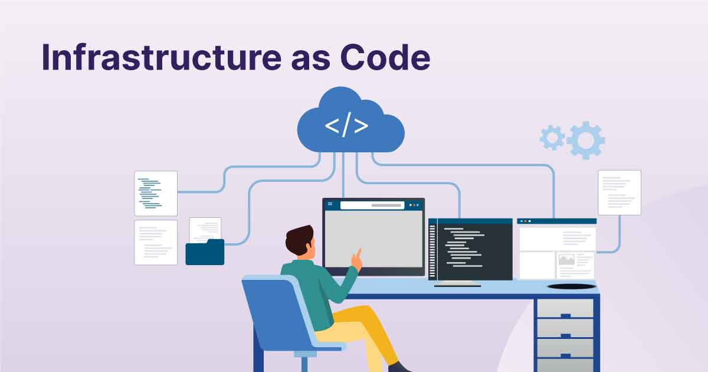

# 🏗️ Infrastructure as Code (IaC)

A collection of **Terraform** and **Ansible** study notes — exploring how to automate cloud infrastructure provisioning, configuration management, and deployment using code.

---

## 📑 Table of Contents

- [⚙️ Ansible](./ansible/README.md)  
  *Configuration management and automation using playbooks and roles*

- [🧰 Debugging](./debugging/)  
  *Common issues and troubleshooting for Terraform and Ansible*

- [🏗️ Dev or Prod](./dev-or-prod/)  
  *Separating development and production environments*

- [🌍 GitHub Repo](./github-repo/)  
  *Repository structure, version control, and workflow setup*

- [🖼️ Images](./images/)  
  *Visual diagrams and reference screenshots*

- [📘 Intro to IaC](./intro-to-iac/README.md)  
  *Foundations of Infrastructure as Code concepts*

- [🌐 Intro to Terraform](./intro-to-terraform/README.md)  
  *Terraform basics, syntax, and deployment examples*

---

### 💡 About

This repository is part of the **Tech511 Cloud Learning** journey — focused on mastering **Infrastructure as Code (IaC)** with **Terraform** and **Ansible**, and building automated, reproducible cloud environments.
