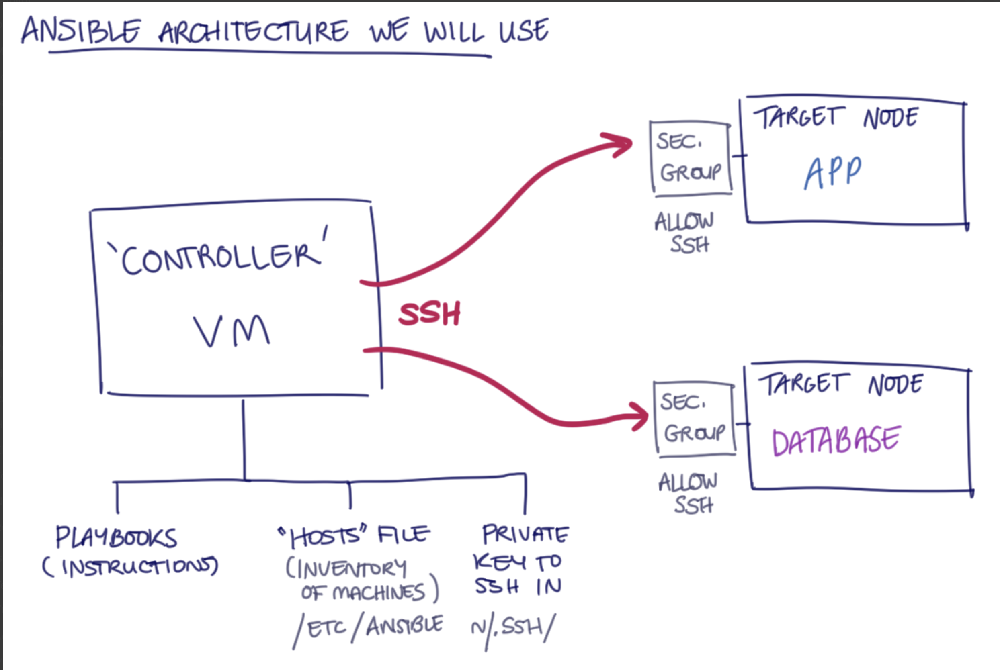

# 🤖 Intro to Ansible

- [🤖 Intro to Ansible](#-intro-to-ansible)
  - [❓ What is Ansible](#-what-is-ansible)
  - [⚙️ How Does it Work?](#️-how-does-it-work)
  - [🖥️ Control Node vs Target Nodes](#️-control-node-vs-target-nodes)
  - [🧰 Controller Setup](#-controller-setup)
    - [Installation](#installation)
    - [Prepare SSH Access (Controller)](#prepare-ssh-access-controller)
    - [Inventory (Hosts) Setup](#inventory-hosts-setup)
    - [Test Connectivity](#test-connectivity)
  - [🧠 Idempotence (Bash vs Ansible)](#-idempotence-bash-vs-ansible)
  - [⚡ Ad Hoc Commands](#-ad-hoc-commands)
    - [Using `--become` for Elevated Privileges](#using---become-for-elevated-privileges)
  - [🗂️ Working with Inventories](#️-working-with-inventories)
    - [View Help Information](#view-help-information)
    - [View the Inventory](#view-the-inventory)
  - [✅ Using Modules](#-using-modules)
    - [Why specify `state=present` if modules are already idempotent?](#why-specify-statepresent-if-modules-are-already-idempotent)
  - [🧾 Creating and Running a Playbook](#-creating-and-running-a-playbook)
    - [Testing with Ad Hoc Commands](#testing-with-ad-hoc-commands)
    - [General Structure of a Playbook](#general-structure-of-a-playbook)
    - [Difference Between “Run App” and “Run App with PM2” Playbooks](#difference-between-run-app-and-run-app-with-pm2-playbooks)
    - [“prov-app-with-npm-start.yml”](#prov-app-with-npm-startyml)
    - ["prov-app-with-pm2.yml"](#prov-app-with-pm2yml)

## ❓ What is Ansible
- A configuration management tool  
- Red Hat leads development  
- Open-source  
- Written in Python  
- Started with a few core modules that managed Linux servers  
- Works with almost any system:
  - Linux & Windows servers  
  - Routers and switches  
  - Cloud services  

## ⚙️ How Does it Work?
- Recipe (code)  
- Ansible (robot) follows the recipe  
- Recipes (the actions/tasks/instructions) are written in YAML called “playbooks”  
- Ansible control node tells the target nodes what to do  
- Agentless:
  - No need to install Ansible on target nodes  
  - Uses SSH to access target nodes + requires a Python interpreter on target nodes  

## 🖥️ Control Node vs Target Nodes

**Control Node**  
- This is the machine where **Ansible is installed** and from which you execute commands or playbooks.  
- It’s responsible for connecting to all the target nodes via SSH and sending configuration instructions.  
- Examples: your **local laptop**, a **dedicated management server**, or a **controller VM** in the cloud.

**Target Nodes (Managed Hosts)**  
- These are the **machines you want to configure or manage** — for example:  
  - A web server (e.g. NGINX or Apache)  
  - A database server (e.g. PostgreSQL or MySQL)  
  - A load balancer, cache, or any other infrastructure component  
- They don’t need Ansible installed — only **SSH access** and **Python**.



On the **Controller Node**, there are two important components:
1. **Playbooks** — YAML files that define what tasks Ansible should perform (like “install nginx” or “create a user”).  
2. **Inventory (hosts)** — a file listing all the target nodes and their connection details (IP addresses, usernames, and SSH keys).  
   - Found at `/etc/ansible/hosts` by default.  
   - You can group hosts (e.g. `[web_servers]`, `[databases]`) for easier management.  

You’ll also need:  
- A **private SSH key** that matches the **public key** stored on each target node.  
- SSH access must be **allowed from the controller** to the target nodes (via their security groups or firewall rules).  

## 🧰 Controller Setup

### Installation
1. `sudo apt-get update -y`  
2. `sudo apt upgrade`  
3. `sudo apt-add-repository ppa:ansible/ansible`  
   ➤ Adds the official **Ansible Personal Package Archive (PPA)** to your system, allowing you to install the latest stable version of Ansible instead of the one from Ubuntu’s default repositories. 
4. Update again: `sudo apt update`  
5. `sudo apt install ansible -y`  
   ➤ Installs **Ansible** and all required dependencies (like Python modules) on your control machine.
6. `ansible --version`  
   ➤ Verifies that Ansible was installed correctly and shows version details, Python version, and config file paths.    
   - Example output snippet: `ansible [core 2.17.14]`  
   - Config file path example: `config file = /etc/ansible/ansible.cfg`

### Prepare SSH Access (Controller)
7.  `cd home`  
8.  `sudo mkdir .ssh`  
9.  `sudo nano tech511-charley-aws.pem`  
   ➤ Opens a text editor to paste your **private SSH key** (used for connecting securely to AWS instances).  
10. `sudo chmod 400 tech511-charley-aws.pem`  
   ➤ Restricts permissions so **only the owner** can read the key file — SSH requires this for security compliance.

### Inventory (Hosts) Setup
11.  `cd /etc/ansible`  
12.  `sudo nano hosts`  
   ➤ Opens Ansible’s **inventory file**, where you define all the remote machines Ansible should manage.
13. Write a group name at the top `[web]` and underneath this define the host entry `ec2-instance ansible_host=<app public IP> ansible_user=ubuntu ansible_ssh_private_key_file=~/.ssh/tech511-charley-aws.pem`  
 
   - `ec2-instance` → a custom alias you can use in playbooks or commands. Rename to fit the instance being used e.g. app, db etc.
   - `ansible_host` → the actual IP or hostname of the server  
   - `ansible_user` → the SSH username (e.g., `ubuntu` for AWS Ubuntu AMIs)  
   - `ansible_ssh_private_key_file` → the path to your SSH key used to authenticate

**Parent and Child Groups:**  

A more advanced inventory can define **group relationships**.  

For example:
```bash
[test:children]
web
db

[web]
app-instance ansible_host=172.31.37.223 ansible_user=ubuntu ansible_ssh_private_key_file=~/.ssh/tech511-charley-aws.pem

[db]
```

`[test:children]` creates a **parent group** called `test` that includes the two **child groups** `web` and `db`.

`[web]` and `[db]` define the individual host groups for the web and database servers.

This structure allows Ansible commands or playbooks to target either:

  - Individual groups (e.g. `ansible web -m ping`)  
  - Or the parent group (e.g. `ansible test -m ping`) to run against all child hosts at once.

### Test Connectivity
14. `ansible all -m ping`  
   ➤ Runs the **`ping` module** on all defined hosts to check SSH connectivity and Ansible control.  
   - It doesn’t use ICMP like the normal `ping` command — instead, it connects over SSH and runs a quick Python test to confirm communication.
   - Each host in your inventory should return something like this:

  ```bash
  ec2-instance | SUCCESS => {
      "changed": false,
      "ping": "pong"
  }
  ```

## 🧠 Idempotence (Bash vs Ansible)

- **Idempotent** means you can run something repeatedly and the system ends up in the same **desired state** (no duplicates, no extra changes). 
- Bash is **imperative**—it runs commands exactly as written, so without checks it can duplicate work (e.g. `echo "line" >> file` adds the line every time). Ansible is **declarative**—modules describe the state you want and only change things if needed (e.g. `apt: name=nginx state=present` installs Nginx if missing, otherwise does nothing; `service: name=nginx state=started` starts it only if it isn’t already). That’s why Ansible tasks are idempotent by default, while Bash usually needs manual guards to be idempotent.

## ⚡ Ad Hoc Commands

- **Ad hoc commands** are used for **one-off tasks** — quick, single-line operations that don’t require a full playbook.  
- These are useful for testing connections, updating packages, checking service status, or performing simple administrative actions.  
- ⚠️ **Ad hoc commands themselves are not automatically idempotent** — idempotence depends on the **module** being used (e.g. `apt` is idempotent, but raw shell commands are not).

### Using `--become` for Elevated Privileges

- In Ansible, the `--become` flag allows the command to be executed with **superuser privileges** (similar to using `sudo` in Bash).  
- Example of a non-idempotent ad hoc command:
  
  ```bash
  ansible web -a "apt-get update -y" --become
  ```

- This works but is not recommended — it directly runs a Bash command rather than using Ansible’s built-in modules.
- It lacks idempotence, meaning it will always run regardless of whether updates are needed.


## 🗂️ Working with Inventories

- The **inventory** in Ansible defines which hosts (servers) the controller can manage.  
- It can include groups (e.g. `[web]`, `[database]`) and connection details for each host.

### View Help Information

```bash
ansible --help
```

- Displays a list of all available options, flags, and usage examples for the `ansible` command.  
- Useful for checking syntax or discovering features such as `--become`, `--limit`, or `--module-name`.

### View the Inventory

List format:

```bash
ansible inventory --list
```

- Shows the inventory in JSON format, listing all groups and their associated hosts.
- Useful for verifying that Ansible can correctly read and interpret the inventory file.

Graph format:

```bash
ansible-inventory --graph
```

- Displays the inventory as a tree structure, showing how hosts are grouped.

Example output:

```bash
@all:
  |--@ungrouped:
  |--@web:
  |  |--ec2-instance
```

`@all` includes every host in the inventory.
`@ungrouped` includes any hosts not assigned to a specific group.
`@web` ia a group containing the host ec2-instance.

## ✅ Using Modules

- The **idempotent** way to perform the same action is by using the `apt` module:
  
  ```bash
  ansible web -m apt -a "update_cache=yes" --become
  ```

`-m` specifies the module to use (apt here).

The `apt` module is shorthand for ansible.builtin.apt (Ansible looks in that namespace by default).

- This approach ensures that Ansible checks the current system state and only performs changes when necessary.
<br>
<br>

  Example output:

```bash
ec2-instance | CHANGED => {
    "ansible_facts": {
        "discovered_interpreter_python": "/usr/bin/python3.10"
    },
    "cache_update_time": 1759744564,
    "cache_updated": true,
    "changed": true
}
```
`CHANGED` means the task successfully updated the cache. If run again without changes required, the output will show "changed": false, demonstrating idempotence.

- Once package information has been updated on the target node, a full system upgrade can be run using the `apt` module.  
- This is still done with an **ad hoc command**, but it remains **idempotent** since the `apt` module checks system state before acting.

```bash
ansible web -m apt -a "upgrade=dist" --become
```

`-m apt` tells Ansible to use the APT module, which manages packages on Debian/Ubuntu systems.

`-a "upgrade=dist"` performs a distribution upgrade, updating all packages to the newest version (similar to sudo apt-get dist-upgrade).

`--become` runs the command with superuser privileges.
<br>
<br>

Example output:

```bash
ec2-instance | SUCCESS => {
    "ansible_facts": {
        "discovered_interpreter_python": "/usr/bin/python3.10"
    },
    "changed": false,.........
```

`"changed": false` means there were **no available upgrades** — the system was already fully up to date. If new packages had been available, the output would show `"changed": true`.  

- Like before, this demonstrates **idempotence** — the command only applies updates when necessary.
- Since this was run using the `apt` module`, it’s considered an **idempotent ad hoc command**.

### Why specify `state=present` if modules are already idempotent?

- **Modules are idempotent**, but they still require a definition of *the desired state* in order to determine what actions to take.  
- Idempotence means *only applying changes when the current system state does not match the desired one.*  
- The parameter `state=present` indicates that the specified package should exist on the system.  
- When executed, the module checks the host to ensure it matches the desired condition:
  - If Nginx **is already installed**, no changes are made → `changed: false`  
  - If Nginx **is not installed**, the module installs it → `changed: true`  

| Parameter | Desired State | Result (Idempotent Action) |
|------------|----------------|-----------------------------|
| `state=present` | Package should be installed | Installs only if missing |
| `state=absent` | Package should be removed | Removes only if present |
| `state=latest` | Package should be updated | Upgrades only if outdated |

🧩 Modules are idempotent *because* they check whether the existing state matches the desired one defined by the parameters. The `state` argument explicitly tells Ansible what condition to verify and enforce.

## 🧾 Creating and Running a Playbook

- A **playbook** is a YAML file that defines one or more tasks for Ansible to perform on specific hosts.  
- Anything that can be done with an **ad hoc command** can also be written as a **task** inside a playbook — and vice versa.

### Testing with Ad Hoc Commands

Before creating a playbook, an ad hoc command can be used to check whether a service (like Nginx) is running:

```bash
ansible web -a "systemctl status nginx" --become

or 

ansible db -a "systemctl status mongod" --become
```

If Nginx is not installed yet, the output may show:

```bash
app-instance | FAILED | rc=4 >>
Unit nginx.service could not be found. non-zero return code
```

This simply means the service does not exist on the target node.

### General Structure of a Playbook

---

```bash
- name: Name of the play (what this play does)
  hosts: target_hosts_group      # e.g. web, db, all
  gather_facts: yes | no         # whether to collect system info
  become: true | false           # whether to use sudo privileges

  vars:                          # optional — define variables for the play
    variable_name: value

  pre_tasks:                     # optional — tasks that run before main tasks
    - name: Description of pre-task
      module_name:
        option: value

  tasks:                         # main list of tasks to perform
    - name: Description of task 1
      module_name:
        option: value

    - name: Description of task 2
      module_name:
        option: value

  handlers:                      # optional — triggered via "notify" on change
    - name: restart service
      module_name:
        option: value

  post_tasks:                    # optional — tasks that run after main tasks
    - name: Cleanup or final steps
      module_name:
        option: value
```

### Difference Between “Run App” and “Run App with PM2” Playbooks

Both playbooks automate the installation of all necessary application dependencies and the deployment of the Node.js app on the **web server**.  
However, they differ in **how the application process is managed and kept running**.

### “prov-app-with-npm-start.yml”
- Starts the Node.js app **manually in the background** using:
  
```bash
nohup npm start > app.log 2>&1 &
```

- **Nohup** (“no hang-up”) prevents the process from stopping when the SSH session ends.  
- The output is redirected to a log file (`app.log`) and the process runs in the background.  
- ❗ However:  
  - The process is **not automatically restarted** if the server reboots or the app crashes.  
  - Management (checking, stopping, restarting) must be done manually.  

### "prov-app-with-pm2.yml"

- Uses **PM2**, a Node.js process manager, to control and monitor the app.  
- PM2 provides:  
  - Automatic restarts if the app crashes.  
  - Startup configuration to **run automatically on reboot**.  


<!-- TASK [Install MongoDB 7.0] ************************************************************************* fatal: [db-instance]: FAILED! => {"cache_update_time": 1759757374, "cache_updated": false, "changed": false, "msg": "'/usr/bin/apt-get -y -o \"Dpkg::Options::=--force-confdef\" -o \"Dpkg::Options::=--force-confold\" install 'mongodb-org=7.0.6'' failed: E: Packages were downgraded and -y was used without --allow-downgrades.\n", "rc": 100, "stderr": "E: Packages were downgraded and -y was used without --allow-downgrades.\n", "stderr_lines": ["E: Packages were downgraded and -y was used without --allow-downgrades."], "stdout": "Reading package lists...\nBuilding dependency tree...\nReading state information...\nThe following packages will be DOWNGRADED:\n mongodb-org\n0 upgraded, 0 newly installed, 1 downgraded, 0 to remove and 0 not upgraded.\n", "stdout_lines": ["Reading package lists...", "Building dependency tree...", "Reading state information...", "The following packages will be DOWNGRADED:", " mongodb-org", "0 upgraded, 0 newly installed, 1 downgraded, 0 to remove and 0 not upgraded."]}


✅ Option 1 (Recommended — simplest)

👉 Just install the latest MongoDB 7.0 instead of pinning a version.

Change this task:

- name: Install MongoDB 7.0
  ansible.builtin.apt:
    name: mongodb-org=7.0.6
    state: present


to:

- name: Install MongoDB 7.0
  ansible.builtin.apt:
    name: mongodb-org
    state: present


That tells Ansible to install or update MongoDB to the latest available 7.0 version, avoiding version conflicts. -->


