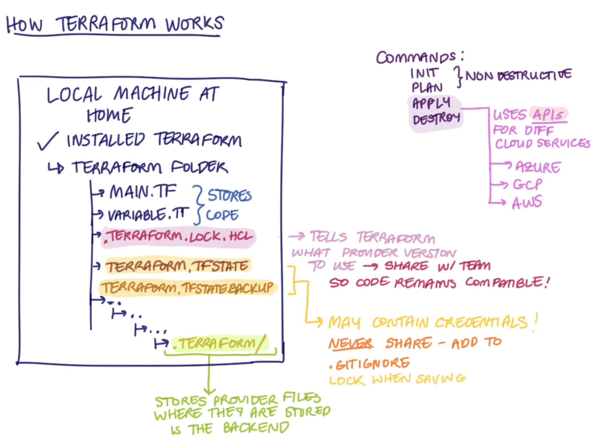

# 🧩 Terraform

- [🧩 Terraform](#-terraform)
  - [🏗️ IaC Setup Guide (Terraform + VS Code)](#️-iac-setup-guide-terraform--vs-code)
  - [☁️ Setting AWS Environment Variables](#️-setting-aws-environment-variables)
  - [🌍 What Is Terraform \& What Is It Used For?](#-what-is-terraform--what-is-it-used-for)
    - [How Does Terraform Act as an Orchestrator?](#how-does-terraform-act-as-an-orchestrator)
  - [✨ What Are the Benefits of Terraform?](#-what-are-the-benefits-of-terraform)
  - [🧭 Alternatives To Terraform](#-alternatives-to-terraform)
  - [🔐 Best Practice: Supplying AWS Credentials to Terraform](#-best-practice-supplying-aws-credentials-to-terraform)
  - [⛔ How Should AWS Credentials Never Be Passed to Terraform?](#-how-should-aws-credentials-never-be-passed-to-terraform)
  - [🌍 Why Use Terraform for Different Environments? (e.g. Production, Testing)](#-why-use-terraform-for-different-environments-eg-production-testing)
  - [🧠 How Does Terraform Work?](#-how-does-terraform-work)
    - [Adding a `.gitignore`](#adding-a-gitignore)
    - [Storing Sensitive Information](#storing-sensitive-information)
  - [💠 Terraform Commands Overview](#-terraform-commands-overview)
    - [terraform plan](#terraform-plan)
    - [terraform apply](#terraform-apply)
    - [terraform destroy](#terraform-destroy)
  - [Configuration Drift](#configuration-drift)
    - [Manual vs Terraform Management](#manual-vs-terraform-management)
  - [💻 Terraform Configuration (Code Explained)](#-terraform-configuration-code-explained)
    - [Provider Block](#provider-block)
    - [VPC (Virtual Private Cloud)](#vpc-virtual-private-cloud)
    - [Subnets](#subnets)
    - [Internet Gateway](#internet-gateway)
    - [Route Table](#route-table)
    - [Route Table Association](#route-table-association)
    - [Database Instance](#database-instance)
    - [Application Instance](#application-instance)
  - [🛰️ External Data Source (Personal IP)](#️-external-data-source-personal-ip)
  - [💡 User Data in Terraform](#-user-data-in-terraform)
  - [⚙️ Meta-Arguments](#️-meta-arguments)
  - [🛡️ Security Groups](#️-security-groups)
  - [🗺️ `map_public_ip_on_launch`](#️-map_public_ip_on_launch)


## 🏗️ IaC Setup Guide (Terraform + VS Code)

**1. Create Your IaC Folder / Repo**

**2. Install terraform**

```bash
brew tap hashicorp/tap
brew install hashicorp/tap/terraform

or if you already have it installed, update to the newest version

brew update
brew upgrade hashicorp/tap/terraform
```

*Note: Homebrew automatically adds Terraform to your PATH, so you can run it from anywhere in the terminal. No manual folder setup is required on macOS. However, if you are a Windows user, it is recommended to create a shared folder for all your command-line tools — for example `C:\my-cmd-line-tools`. Then move `terraform.exe` (and any other tools you install in the future) into that folder, and add it to your **PATH** environment variable. This ensures you can run Terraform and other CLI tools from any directory without needing to specify their full file paths*

**3.  Set Up VS Code**

- Open VS Code
- Go to Extensions (`⇧⌘X` on macOS or `Ctrl + Shift + X` on Windows)
- Search for “Terraform” → install the official one by HashiCorp
- (Optional) Install the “Ansible” extension by Red Hat

**4. Verify Everything Works**

- Run `terraform --version` to check that Terraform is installed correctly.  
- **Expected output:** `Terraform v1.13.3 on windows_amd64`  
- Open a **new PowerShell or Git Bash** window and run `terraform --version` again.  

✅ If it works there too, your **PATH** is correctly configured.  
This step confirms Terraform is installed **system-wide**, meaning you can run Terraform commands from **any directory** — not just the folder where it was installed.  

⚠️ If the command only works in one specific folder, Terraform isn’t in your PATH and needs to be added manually.

---

## ☁️ Setting AWS Environment Variables

**1. Open your terminal**

**2. Open your shell configuration file**

Run the following command to open your `.zshrc` file in the nano text editor:

`nano ~/.zshrc`

*💻 Windows users:* open **Git Bash** instead, and use the same command to edit your `.bash_profile`:

`nano ~/.bash_profile`


**3. Add your AWS credentials**

Scroll to the bottom of the file and add these two lines (replace with your actual keys):

```bash
export AWS_ACCESS_KEY_ID=your_access_key_here
export AWS_SECRET_ACCESS_KEY=your_secret_key_here
```

**4. Save and exit**

- Press `CTRL + O` → `Enter` to save  
- Then press `CTRL + X` to exit nano

**5. Reload your shell configuration**

This applies your changes immediately without restarting your terminal:

`source ~/.zshrc`

*💻 Windows users:* run the same command but replace `.zshrc` with `.bash_profile`:

`source ~/.bash_profile`

**6. Verify the variables are set**

Check that both variables are available:

```bash
printenv AWS_ACCESS_KEY_ID
printenv AWS_SECRET_ACCESS_KEY
```

✅ If both commands display your keys, the setup worked correctly.

--

## 🌍 What Is Terraform & What Is It Used For?

* Orchestration tool
* Best for infrastructure provisioning
* Originally inspired by AWS CloudFormation
* Sees infrastructure as immutable (i.e. disposable)
  * Compare this to CM tools which usually see infrastructure as mutable/reusable
* Code in Hashicopr Configuration Language (HCL)
  * Aims to give a balance between human- and machine-readability
  * HCL can be converted to JSON and vice versa

### How Does Terraform Act as an Orchestrator?

Takes care of order in which to create/modify/destroy

---

## ✨ What Are the Benefits of Terraform?

+ Easy to use  
  + Terraform uses a simple configuration language (HCL) that's easy to learn and read.  
  + It clearly defines what you want to create (e.g. S3 bucket, EC2 instance) without complex scripting.  

+ Sort of open-source  
  + Since 2023, Terraform uses a **Business Source License (BSL)** — this means it’s still free to use, but **cannot be used to build competing products**.  
  + Because of this, some organisations have started using **OpenTofu**, an open-source, drop-in alternative maintained by the Linux Foundation.  

+ Declarative  
  + You describe **what** infrastructure you want (e.g. “I want an EC2 instance”), and Terraform figures out **how** to make it happen.  
  + This contrasts with **imperative** tools (like Bash scripts) where you must manually tell the system **how** to do each step.  

+ Cloud-agnostic  
  + Terraform works across **many cloud providers** (AWS, Azure, GCP, etc.), as well as other services like GitHub or Datadog.  
  + To use a specific cloud, you need to **download the “provider”** (a plug-in) for that cloud provider.  
  + Each cloud vendor maintains its own provider, so Terraform can communicate with it using APIs.  
  + This makes Terraform very **flexible, expressive, and extendible** — one tool to manage everything, even in multi-cloud setups.  

---

## 🧭 Alternatives To Terraform

- **Pulumi** – Similar to Terraform but **imperative**, meaning you use real programming languages (like Python, TypeScript, or Go) to write your infrastructure code.  
  
- **AWS CloudFormation**, **GCP Deployment Manager**, **Azure Resource Manager** – Cloud-specific IaC products. These are managed by the individual cloud vendors and only work within their own ecosystems.

---

## 🔐 Best Practice: Supplying AWS Credentials to Terraform

Terraform looks for credentials in this order:

1. **Environment variables:**  
   `AWS_ACCESS_KEY_ID` and `AWS_SECRET_ACCESS_KEY`
   ➡️ (okay if for local use is restricted to your user)

2. **Terraform variables:**  
   ❌ Should **never** be used — we **never hard-code credentials** in `.tf` files or variable definitions.

3. **AWS CLI configuration:**  
   When you run `aws configure`, Terraform can automatically read credentials from the AWS CLI’s config and credentials files. ➡️ (good way of doing it)

4. **If using Terraform on EC2 instance**, we can give an IAM role ➡️ (absolutely best practice)

---

## ⛔ How Should AWS Credentials Never Be Passed to Terraform?

- **NEVER hard-code them** in `.tf` files or variables.  
- Credentials must **never end up in a public Git repo** — this is a major security risk.

---

## 🌍 Why Use Terraform for Different Environments? (e.g. Production, Testing)

Examples:

- **Testing environment**  
  - Easily/quickly spin up infrastructure for testing purposes that mirrors production.  
  - Easily/quickly bring it down at COB (close of business).  

  - **Consistency between environments**, reducing bugs caused by my environment discrepancies. 

---

## 🧠 How Does Terraform Work?

On Our Local Machine:



- Installed Terraform (`terraform --version`)
- Folder contains:
  - `main.tf` → stores main configuration code  
  - `variable.tf` → stores variable definitions  
  - `.terraform.lock.hcl` → locks your provider version  
  - `terraform.tfstate` → can contain credentials (stores infrastructure state in backend)  
  - `terraform.tfstate.backup` → backup of the state file (can contain credentials)  
  - `.terraform/` folder → stores provider files and modules

Terraform checks what’s stored in the state folders, downloads providers, and sets up the backend.

- `terraform plan` → non-destructive; shows what changes will be made  
- `terraform apply` / `terraform destroy` → connects to APIs using the provider file and applies or removes resources


### Adding a `.gitignore`
- You can select this when creating a repo on GitHub  
- Or, if already created and working locally, run:

```bash
curl -s https://raw.githubusercontent.com/github/gitignore/main/Terraform.gitignore
 -o .gitignore
 ```

### Storing Sensitive Information

All sensitive information must be encrypted at rest and in transit.
Passwords and other secrets should be stored in a dedicated secrets manager (e.g., AWS Secrets Manager or HashiCorp Vault) rather than directly in code or configuration files.

---

## 💠 Terraform Commands Overview

### terraform plan

- **Purpose:** Previews the changes Terraform *would* make without applying them.  
- **Output Example:**  
  Plan: 1 to add, 0 to change, 0 to destroy  
- **Key Point:**  
  Non-destructive — it **does not** modify your infrastructure.  
  Use it to review and confirm changes before applying.


### terraform apply

- **Purpose:** Executes the plan — **creates, updates, or deletes** resources based on your configuration.  
- **Usage:**  
  terraform apply  
- **Key Point:**  
  Destructive — it **does** modify your infrastructure.  
- **Tip:**  
  Always review the plan summary carefully before typing “yes” to confirm.


### terraform destroy

- **Purpose:** Removes **all** infrastructure defined in your Terraform configuration.  
- **Usage:**  
  terraform destroy  
- **Key Point:**  
  Destructive — it **does** modify your infrastructure.  
- **Warning:**  
  This action is **irreversible** — it permanently deletes all managed resources.


## Configuration Drift
- Example: Load balancer on several app VMs  
- Changes may occur on individual VMs  
- Problem: Things not running properly between machines (something out of date)  

**Solution:**  
- Configuration management tools like **Ansible** can handle these issues.  
- If the drift is minor (e.g., a name change or infrastructure out of alignment), re-running Terraform (an orchestration tool) will fix it.


### Manual vs Terraform Management

- Avoid switching between manual AWS Console changes and Terraform management.  
- Doing so can cause **drift** — where real infrastructure no longer matches your Terraform state.  
- Always update and apply changes through Terraform for consistency and accuracy.

---

## 💻 Terraform Configuration (Code Explained)

### Provider Block
- Defines which **cloud provider** to use (AWS).  
- Region is passed as a variable (`var.aws_region`).  
- On `terraform init`, Terraform downloads the **AWS provider plugin** into the hidden `.terraform` folder.

### VPC (Virtual Private Cloud)
- Creates an **isolated network** for resources.  
- `cidr_block` defines the private IP address range.  
- All other infrastructure (subnets, EC2, etc.) exists inside this VPC.

### Subnets
- **Public subnet** → hosts the app EC2 (internet-facing).  
- **Private subnet** → hosts the database EC2 (no direct internet access).  
- Each subnet is tied to a specific **availability zone** for resilience.  
- `map_public_ip_on_launch = true` automatically assigns public IPs to instances in the public subnet.

### Internet Gateway
- Connects the VPC to the **internet**.  
- Required for any instances that need public access.  
- Must be attached to the same VPC as the subnets.

### Route Table
- Defines **where traffic goes**.  
- `cidr_block = "0.0.0.0/0"` → routes all outbound internet traffic through the Internet Gateway.  
- The public subnet must be explicitly **associated** with this route table.

### Route Table Association
- Links the **public subnet** to the route table.  
- Without this association, even with an Internet Gateway, the subnet will not have internet connectivity.

### Database Instance
- Deployed in the **private subnet** (no public IP).  
- Uses the **DB security group**.  
- Accessible only from the app subnet.

### Application Instance
- Deployed in the **public subnet** (has a public IP).  
- Uses the **App security group**.  
- Connects to the database via its **private IP**.  
- Depends on the database instance (`depends_on` ensures correct creation order).

---

## 🛰️ External Data Source (Personal IP)

Used to dynamically fetch the **current public IP address** of the local machine running Terraform.

Terraform does this with an **external data source**, which allows it to execute an external program and read its output.

```bash
data "external" "personal_ip" {
program = ["bash", "-c", "curl -s 'https://api.ipify.org?format=json'"]
}
```

**Explanation:**
- `data` → defines a **data source** (something Terraform reads but doesn’t create).  
- `"external"` → tells Terraform to use the **external data source plugin**, which can execute programs and capture their output.  
- `program = [...]` → specifies the command to run:
  - `"bash"` → runs the command in a Bash shell.  
  - `"-c"` → tells Bash to **execute the following string** as a command.  
  - `"curl -s 'https://api.ipify.org?format=json'"` → quietly (`-s`) calls the `ipify.org` API to return the machine’s public IP address in JSON format (e.g. `{"ip": "82.41.123.57"}`).

The command runs locally, Terraform reads the JSON response, and makes it accessible under `data.external.personal_ip.result.ip`

**Why this is useful:**  
- Prevents manually hardcoding an IP address in the configuration.  
- Ensures SSH access is always limited to the machine applying the Terraform code.  
- Keeps security groups automatically up to date if the IP changes.

**Example in the configuration:**

`cidr_blocks = ["${data.external.personal_ip.result.ip}/32"]`

-  `${ ... }` → interpolation syntax used to **insert a Terraform value** (like a variable or data source result) inside a string.
- `data.external.personal_ip.result.ip` retrieves the IP returned by the external data source.  
- `/32` is essential — it represents a **single IP address** in CIDR notation, meaning **only that one IP** is allowed access.  
  (Without `/32`, AWS would interpret it as an invalid or incomplete range.)

**Summary:**
- The external data source dynamically gets the current IP.  
- Adding `/32` locks SSH access down to just that IP for maximum security.  
- Ideal for creating security groups that only allow personal SSH access.

---

## 💡 User Data in Terraform

Terraform provides two functions for including these scripts:

| Function | Variable Substitution | Use Case |
|-----------|----------------------|-----------|
| `file()` | ❌ No | For **static** scripts that don’t change between environments |
| `templatefile()` | ✅ Yes | For **dynamic** scripts that need to inject variable values (e.g. private IPs, database names, credentials) |

**Example Explanation:**

```bash
user_data = templatefile("scripts/app-user-data.sh", 
{ db_ip = aws_instance.db_instance.private_ip })
```

- `templatefile()` reads the file `scripts/app-user-data.sh`.
- Inside that script, any placeholder written as `${db_ip}` will be replaced with the **private IP address** of the database EC2 instance.
- This allows the application instance to automatically know how to connect to the database on launch, without manually editing the script.

**Summary:**
- Use `file()` when the script stays the same everywhere (e.g. basic setup).  
- Use `templatefile()` when the script must dynamically reference Terraform resources or variables.

Although terraform runs the db automatically first as the app references the db it's good to use depends on explicity for human readability.

---

## ⚙️ Meta-Arguments

- `depends_on` → enforces resource creation order (used to launch the db before the app)
- `count` → creates multiple identical resources.  
- `for_each` → creates multiple unique resources from a map or list.  

Terraform automatically detects dependencies when one resource references another (e.g. `aws_instance.db_instance.private_ip`).

Although Terraform automatically provisions the database first because the app depends on it, it’s still good practice to use depends_on explicitly for clarity and human readability.

---

## 🛡️ Security Groups

- Use `{}` or `[]` to clear default rules before defining custom ones.  
- Example: `ingress = []`, `egress = []`.

Protocols:

- `protocol = "tcp"` → used for SSH, HTTP, etc.  
- `protocol = "-1"` → allows all protocols (used for full outbound access).

If comparing these rules to the AWS console manual insertion:

The **Type** dropdown in the AWS Console is a shortcut — it automatically fills in the protocol and port range for you.

| Type (Console) | Protocol | Port | Equivalent in Terraform |
|----------------|-----------|------|--------------------------|
| SSH | TCP | 22 | `protocol = "tcp"`, `from_port = 22`, `to_port = 22` |
| HTTP | TCP | 80 | `protocol = "tcp"`, `from_port = 80`, `to_port = 80` |
| Custom TCP | TCP | Custom | `protocol = "tcp"`, `from_port = <port>`, `to_port = <port>` |

Terraform doesn’t use a `type` field — you must define each protocol and port range explicitly.

---

## 🗺️ `map_public_ip_on_launch`

In the AWS Console, the **“Enable Auto-assign Public IP”** toggle appears during EC2 setup, but it actually controls a **subnet-level** setting.

When this option is enabled, AWS configures the subnet to automatically assign public IPs to any instance launched inside it.

In Terraform: 

`map_public_ip_on_launch = true` is on the subnet level.

→ Automatically assigns a public IP to every instance in the subnet.

`associate_public_ip_address = true` is on the instance level.

→ Assigns a public IP only to that specific instance.

**Why subnet-level is preferred:**
- Cleaner and easier to manage.  
- Reflects how AWS handles this setting internally.  
- Avoids repeating the same config for each public instance.

**Summary:**
The console toggle looks instance-specific, but it’s a subnet setting.  

In Terraform, use `map_public_ip_on_launch` for subnet-wide behaviour and reserve `associate_public_ip_address` for one-off overrides.


