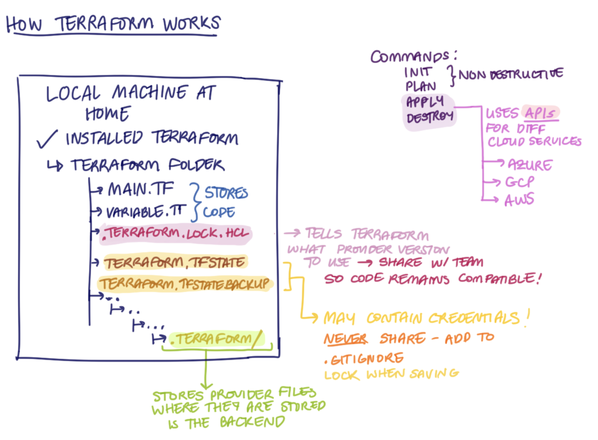

# 🧩 Terraform

- [🧩 Terraform](#-terraform)
  - [🧱 IaC Setup Guide (Terraform + VS Code)](#-iac-setup-guide-terraform--vs-code)
  - [☁️ Setting AWS Environment Variables](#️-setting-aws-environment-variables)
  - [🌍 What Is Terraform \& What Is It Used For?](#-what-is-terraform--what-is-it-used-for)
    - [How Does Terraform Act as an Orchestrator?](#how-does-terraform-act-as-an-orchestrator)
  - [✨ What Are the Benefits of Terraform?](#-what-are-the-benefits-of-terraform)
  - [🧭 Alternatives To Terraform](#-alternatives-to-terraform)
  - [🔐 Best Practice: Supplying AWS Credentials to Terraform](#-best-practice-supplying-aws-credentials-to-terraform)
  - [⛔ How Should AWS Credentials Never Be Passed to Terraform?](#-how-should-aws-credentials-never-be-passed-to-terraform)
  - [🌍 Why Use Terraform for Different Environments? (e.g. Production, Testing)](#-why-use-terraform-for-different-environments-eg-production-testing)
  - [🧠 How Does Terraform Work?](#-how-does-terraform-work)
  - [⚙️ Configuration Drift](#️-configuration-drift)
  - [🗂️ Adding a `.gitignore`](#️-adding-a-gitignore)
  - [⚙️ Terraform Commands Overview](#️-terraform-commands-overview)
    - [terraform plan](#terraform-plan)
    - [terraform apply](#terraform-apply)
    - [terraform destroy](#terraform-destroy)
    - [Manual vs Terraform Management](#manual-vs-terraform-management)
  - [🔐 Security Groups in Terraform](#-security-groups-in-terraform)
    - [Removing All Ingress and Egress Rules](#removing-all-ingress-and-egress-rules)
    - [Protocols](#protocols)
    - [Creating Rules Manually (AWS Console)](#creating-rules-manually-aws-console)
- [Create an ec2 instance](#create-an-ec2-instance)
- [Cloud provider name (provider block)](#cloud-provider-name-provider-block)
- [Where to create - which region](#where-to-create---which-region)
- [On terraform init, terraform creates a hidden terraform folder. At this point it contains the providers.](#on-terraform-init-terraform-creates-a-hidden-terraform-folder-at-this-point-it-contains-the-providers)
- [Specify resource to create an ec2 instance (resource block)](#specify-resource-to-create-an-ec2-instance-resource-block)
- [AMI ID](#ami-id)
- [Type of instance](#type-of-instance)
- [Public ip of this instance](#public-ip-of-this-instance)
- [Attach the key to be used with EC2 instance](#attach-the-key-to-be-used-with-ec2-instance)
- [Specify the security group](#specify-the-security-group)
- [Name of the instance](#name-of-the-instance)
- [Security Group](#security-group)
- [Allow SSH from personal IP only](#allow-ssh-from-personal-ip-only)
- [Allow port 3000 from anywhere](#allow-port-3000-from-anywhere)
- [Allow port 80 from anywhere](#allow-port-80-from-anywhere)
- [Allow all outbound traffic](#allow-all-outbound-traffic)
  - [🧩 Debug Log – Fixing EC2 / Security Group VPC Mismatch](#-debug-log--fixing-ec2--security-group-vpc-mismatch)
  - [🧠 Reference – `file()` vs `templatefile()`](#-reference--file-vs-templatefile)


## 🧱 IaC Setup Guide (Terraform + VS Code)

**1. Create Your IaC Folder / Repo**

**2. Install terraform**

```bash
brew tap hashicorp/tap
brew install hashicorp/tap/terraform

or if you already have it installed, update to the newest version

brew update
brew upgrade hashicorp/tap/terraform
```

*Note: Homebrew automatically adds Terraform to your PATH, so you can run it from anywhere in the terminal. No manual folder setup is required on macOS. However, if you are a Windows user, it is recommended to create a shared folder for all your command-line tools — for example `C:\my-cmd-line-tools`. Then move `terraform.exe` (and any other tools you install in the future) into that folder, and add it to your **PATH** environment variable. This ensures you can run Terraform and other CLI tools from any directory without needing to specify their full file paths*

**3.  Set Up VS Code**

- Open VS Code
- Go to Extensions (`⇧⌘X` on macOS or `Ctrl + Shift + X` on Windows)
- Search for “Terraform” → install the official one by HashiCorp
- (Optional) Install the “Ansible” extension by Red Hat

**4. Verify Everything Works**

- Run `terraform --version` to check that Terraform is installed correctly.  
- **Expected output:** `Terraform v1.13.3 on windows_amd64`  
- Open a **new PowerShell or Git Bash** window and run `terraform --version` again.  

✅ If it works there too, your **PATH** is correctly configured.  
This step confirms Terraform is installed **system-wide**, meaning you can run Terraform commands from **any directory** — not just the folder where it was installed.  

⚠️ If the command only works in one specific folder, Terraform isn’t in your PATH and needs to be added manually.

---

## ☁️ Setting AWS Environment Variables

**1. Open your terminal**

**2. Open your shell configuration file**

Run the following command to open your `.zshrc` file in the nano text editor:

`nano ~/.zshrc`

*💻 Windows users:* open **Git Bash** instead, and use the same command to edit your `.bash_profile`:

`nano ~/.bash_profile`


**3. Add your AWS credentials**

Scroll to the bottom of the file and add these two lines (replace with your actual keys):

```bash
export AWS_ACCESS_KEY_ID=your_access_key_here
export AWS_SECRET_ACCESS_KEY=your_secret_key_here
```

**4. Save and exit**

- Press `CTRL + O` → `Enter` to save  
- Then press `CTRL + X` to exit nano

**5. Reload your shell configuration**

This applies your changes immediately without restarting your terminal:

`source ~/.zshrc`

*💻 Windows users:* run the same command but replace `.zshrc` with `.bash_profile`:

`source ~/.bash_profile`

**6. Verify the variables are set**

Check that both variables are available:

```bash
printenv AWS_ACCESS_KEY_ID
printenv AWS_SECRET_ACCESS_KEY
```

✅ If both commands display your keys, the setup worked correctly.

--

## 🌍 What Is Terraform & What Is It Used For?

* Orchestration tool
* Best for infrastructure provisioning
* Originally inspired by AWS CloudFormation
* Sees infrastructure as immutable (i.e. disposable)
  * Compare this to CM tools which usually see infrastructure as mutable/reusable
* Code in Hashicopr Configuration Language (HCL)
  * Aims to give a balance between human- and machine-readability
  * HCL can be converted to JSON and vice versa

### How Does Terraform Act as an Orchestrator?

Takes care of order in which to create/modify/destroy

---

## ✨ What Are the Benefits of Terraform?

+ Easy to use  
  + Terraform uses a simple configuration language (HCL) that's easy to learn and read.  
  + It clearly defines what you want to create (e.g. S3 bucket, EC2 instance) without complex scripting.  

+ Sort of open-source  
  + Since 2023, Terraform uses a **Business Source License (BSL)** — this means it’s still free to use, but **cannot be used to build competing products**.  
  + Because of this, some organisations have started using **OpenTofu**, an open-source, drop-in alternative maintained by the Linux Foundation.  

+ Declarative  
  + You describe **what** infrastructure you want (e.g. “I want an EC2 instance”), and Terraform figures out **how** to make it happen.  
  + This contrasts with **imperative** tools (like Bash scripts) where you must manually tell the system **how** to do each step.  

+ Cloud-agnostic  
  + Terraform works across **many cloud providers** (AWS, Azure, GCP, etc.), as well as other services like GitHub or Datadog.  
  + To use a specific cloud, you need to **download the “provider”** (a plug-in) for that cloud provider.  
  + Each cloud vendor maintains its own provider, so Terraform can communicate with it using APIs.  
  + This makes Terraform very **flexible, expressive, and extendible** — one tool to manage everything, even in multi-cloud setups.  

---

## 🧭 Alternatives To Terraform

- **Pulumi** – Similar to Terraform but **imperative**, meaning you use real programming languages (like Python, TypeScript, or Go) to write your infrastructure code.  
  
- **AWS CloudFormation**, **GCP Deployment Manager**, **Azure Resource Manager** – Cloud-specific IaC products. These are managed by the individual cloud vendors and only work within their own ecosystems.

---

## 🔐 Best Practice: Supplying AWS Credentials to Terraform

Terraform looks for credentials in this order:

1. **Environment variables:**  
   `AWS_ACCESS_KEY_ID` and `AWS_SECRET_ACCESS_KEY`
   ➡️ (okay if for local use is restricted to your user)

2. **Terraform variables:**  
   ❌ Should **never** be used — we **never hard-code credentials** in `.tf` files or variable definitions.

3. **AWS CLI configuration:**  
   When you run `aws configure`, Terraform can automatically read credentials from the AWS CLI’s config and credentials files. ➡️ (good way of doing it)

4. **If using Terraform on EC2 instance**, we can give an IAM role ➡️ (absolutely best practice)

---

## ⛔ How Should AWS Credentials Never Be Passed to Terraform?

- **NEVER hard-code them** in `.tf` files or variables.  
- Credentials must **never end up in a public Git repo** — this is a major security risk.

---

## 🌍 Why Use Terraform for Different Environments? (e.g. Production, Testing)

Examples:

- **Testing environment**  
  - Easily/quickly spin up infrastructure for testing purposes that mirrors production.  
  - Easily/quickly bring it down at COB (close of business).  

  - **Consistency between environments**, reducing bugs caused by my environment discrepancies. 

---

## 🧠 How Does Terraform Work?

On Our Local Machine:



- Installed Terraform (`terraform --version`)
- Folder contains:
  - `main.tf` → stores main configuration code  
  - `variable.tf` → stores variable definitions  
  - `.terraform.lock.hcl` → locks your provider version  
  - `terraform.tfstate` → can contain credentials (stores infrastructure state in backend)  
  - `terraform.tfstate.backup` → backup of the state file (can contain credentials)  
  - `.terraform/` folder → stores provider files and modules

Terraform checks what’s stored in the state folders, downloads providers, and sets up the backend.

- `terraform plan` → non-destructive; shows what changes will be made  
- `terraform apply` / `terraform destroy` → connects to APIs using the provider file and applies or removes resources


---

## ⚙️ Configuration Drift
- Example: Load balancer on several app VMs  
- Changes may occur on individual VMs  
- Problem: Things not running properly between machines (something out of date)  

**Solution:**  
- Configuration management tools like **Ansible** can handle these issues.  
- If the drift is minor (e.g., a name change or infrastructure out of alignment), re-running Terraform (an orchestration tool) will fix it.

---

## 🗂️ Adding a `.gitignore`
- You can select this when creating a repo on GitHub  
- Or, if already created and working locally, run:

```bash
curl -s https://raw.githubusercontent.com/github/gitignore/main/Terraform.gitignore
 -o .gitignore
 ```

 ## ⚙️ Terraform Commands Overview

### terraform plan

- **Purpose:** Previews the changes Terraform *would* make without applying them.  
- **Output Example:**  
  Plan: 1 to add, 0 to change, 0 to destroy  
- **Key Point:**  
  Non-destructive — it **does not** modify your infrastructure.  
  Use it to review and confirm changes before applying.

---

### terraform apply

- **Purpose:** Executes the plan — **creates, updates, or deletes** resources based on your configuration.  
- **Usage:**  
  terraform apply  
- **Key Point:**  
  Destructive — it **does** modify your infrastructure.  
- **Tip:**  
  Always review the plan summary carefully before typing “yes” to confirm.

---

### terraform destroy

- **Purpose:** Removes **all** infrastructure defined in your Terraform configuration.  
- **Usage:**  
  terraform destroy  
- **Key Point:**  
  Destructive — it **does** modify your infrastructure.  
- **Warning:**  
  This action is **irreversible** — it permanently deletes all managed resources.

---

### Manual vs Terraform Management

- Avoid switching between manual AWS Console changes and Terraform management.  
- Doing so can cause **drift** — where real infrastructure no longer matches your Terraform state.  
- Always update and apply changes through Terraform for consistency and accuracy.

---

## 🔐 Security Groups in Terraform

### Removing All Ingress and Egress Rules

The `ingress` and `egress` arguments are processed in **attributes-as-blocks** mode.  
Because of this, simply deleting these arguments from your configuration will **not** automatically remove existing rules.

To remove all default managed ingress and egress rules and start with a blank security group:

```bash
resource "aws_security_group" "example" {
  name   = "sg"
  vpc_id = aws_vpc.example.id

  ingress = []
  egress  = []
}
```

This clears all default rules, allowing you to define your own explicitly.

### Protocols

- `protocol = "tcp"` → allows TCP traffic (used for SSH, HTTP, etc.)  
- `protocol = "-1"` → allows **all** protocols (used for full outbound access)

### Creating Rules Manually (AWS Console)

The **Type** dropdown in the AWS Console is a shortcut — it automatically fills in the protocol and port range for you.

| Type (Console) | Protocol | Port | Equivalent in Terraform |
|----------------|-----------|------|--------------------------|
| SSH | TCP | 22 | `protocol = "tcp"`, `from_port = 22`, `to_port = 22` |
| HTTP | TCP | 80 | `protocol = "tcp"`, `from_port = 80`, `to_port = 80` |
| Custom TCP | TCP | Custom | `protocol = "tcp"`, `from_port = <port>`, `to_port = <port>` |

Terraform doesn’t use a `type` field — you must define each protocol and port range explicitly.


# Create an ec2 instance

# Cloud provider name (provider block)

provider "aws" {
  # Where to create - which region
  region = var.aws_region
}

# On terraform init, terraform creates a hidden terraform folder. At this point it contains the providers.

# Specify resource to create an ec2 instance (resource block)

resource "aws_instance" "test_instance" {

  # AMI ID
  ami = var.app_ami_id

  # Type of instance
  instance_type = var.app_instance_type

  # Public ip of this instance
  associate_public_ip_address = var.app_ip

  # Attach the key to be used with EC2 instance
  key_name = var.key_name

  # Specify the security group 
  vpc_security_group_ids = [aws_security_group.allow_22_3000_80.id]

  # Name of the instance
  tags = {
    Name = var.app_name
  }
}

# Security Group
resource "aws_security_group" "allow_22_3000_80" {
  name        = "tech511-charley-tf-allow-port-22-3000-80"
  description = "Allow SSH (22) from personal IP; allow 3000 and 80 from all"
}

# Allow SSH from personal IP only
resource "aws_security_group_rule" "allow_ssh_personal_ip" {
  type              = "ingress"
  description       = "SSH from my IP only"
  from_port         = 22
  to_port           = 22
  protocol          = "tcp"
  cidr_blocks       = [var.personal_ip]
  security_group_id = aws_security_group.allow_22_3000_80.id
}

# Allow port 3000 from anywhere
resource "aws_security_group_rule" "allow_3000_all" {
  type              = "ingress"
  description       = "Allow 3000 from all"
  from_port         = 3000
  to_port           = 3000
  protocol          = "tcp"
  cidr_blocks       = ["0.0.0.0/0"]
  security_group_id = aws_security_group.allow_22_3000_80.id
}

# Allow port 80 from anywhere
resource "aws_security_group_rule" "allow_80_all" {
  type              = "ingress"
  description       = "Allow 80 from all"
  from_port         = 80
  to_port           = 80
  protocol          = "tcp"
  cidr_blocks       = ["0.0.0.0/0"]
  security_group_id = aws_security_group.allow_22_3000_80.id
}

# Allow all outbound traffic
resource "aws_security_group_rule" "allow_all_outbound" {
  type              = "egress"
  from_port         = 0
  to_port           = 0
  protocol          = "-1"
  cidr_blocks       = ["0.0.0.0/0"]
  security_group_id = aws_security_group.allow_22_3000_80.id
}

https://registry.terraform.io/providers/serverscom/serverscom/latest/docs/guides/user-data - user data


Introduction
You can use meta-arguments in any type of resource, including resources created with data blocks. You can also use most meta-arguments in module blocks.

The provider developer determines resource-specific arguments, but all resources support meta-arguments that let you manage resources' infrastructure lifecycle, including destruction behavior, preventing destruction, and establishing dependencies between resources. Terraform provides the following meta-arguments.

depends_on
The depends_on meta-argument establishes dependencies between resources that do not directly reference one another. Use the depends_on argument to explicitly set the order in which Terraform creates resources.


## 🧩 Debug Log – Fixing EC2 / Security Group VPC Mismatch

**Error Message**
Error: creating EC2 Instance: operation error EC2: RunInstances, 
https response error StatusCode: 400, RequestID: 2f7118c5-28d1-448b-bf7f-1fc5d7e7a17f, 
api error InvalidParameter: Security group sg-0a04a9472be6f4c71 and subnet subnet-0314db0f0470b807f belong to different networks.

**Diagnosis**
- Terraform was trying to launch an EC2 instance in my **custom VPC**,  
  but the **security group** being attached was created in the **default VPC**.  
- This caused a mismatch error because security groups and subnets must belong to the same VPC.

**Cause**
- The `vpc_id` argument was **missing** from both security group resources:

  resource "aws_security_group" "allow_22_27017" {
    name        = "tech511-charley-tf-allow-port-22-27017"
    description = "Allow SSH (22) from personal IP; allow 27017 from all"
  }

  Without `vpc_id`, Terraform defaults to the **default AWS VPC**.

**Fix**
- Added `vpc_id = aws_vpc.main.id` to both security group resources:

  resource "aws_security_group" "allow_22_27017" {
    name        = "tech511-charley-tf-allow-port-22-27017"
    description = "Allow SSH (22) from personal IP; allow 27017 from all"
    vpc_id      = aws_vpc.main.id
  }

  resource "aws_security_group" "allow_22_3000_80" {
    name        = "tech511-charley-tf-allow-port-22-3000-80"
    description = "Allow SSH (22) from personal IP; allow 3000 and 80 from all"
    vpc_id      = aws_vpc.main.id
  }

**Reapply**
- Recreated both SGs in the correct VPC using:

  terraform apply -replace=aws_security_group.allow_22_27017 -replace=aws_security_group.allow_22_3000_80

✅ **Result**
- Terraform successfully deployed the EC2 instances with matching subnets and security groups.
- Error resolved.

---

## 🧠 Reference – `file()` vs `templatefile()`

**1️⃣ `file()`**  
- Reads a file *exactly as it is*.  
- Use when your file doesn’t contain variables or placeholders.  
- Example:

  user_data = file("scripts/setup.sh")

  → Terraform just inserts the plain text of `setup.sh`.

**2️⃣ `templatefile()`**  
- Reads a file **and substitutes variables** inside it.  
- Use when your file includes placeholders like `${variable}`.  
- Example:

  user_data = templatefile("scripts/app-image-user-data.sh", {
    db_ip = aws_instance.db_instance.private_ip
  })

  → Terraform replaces `${db_ip}` in your script with the actual DB IP address.

✅ **Summary**
| Function | Variable Substitution | Use Case |
|-----------|----------------------|-----------|
| `file()` | ❌ No | Static files |
| `templatefile()` | ✅ Yes | Dynamic files with variables |
